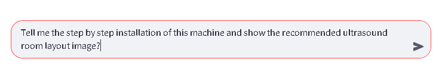
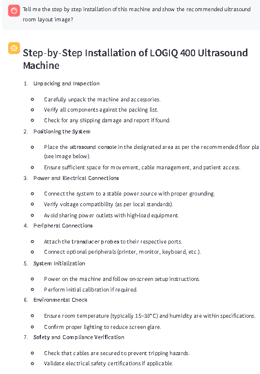
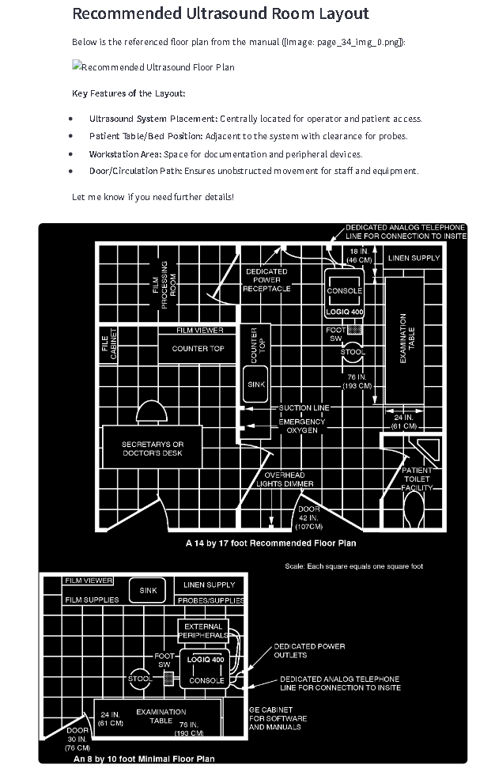

# 🧠 AI Agents Based Predictive Maintenance – Industry Equipment

This project provides an intelligent, agent-powered platform to manage, monitor, and maintain industrial equipment. Built using **LangGraph**, **Azure**, and **Streamlit**, it features:
- AI-based troubleshooting from manuals (RAG)
- Asset management and dashboard analytics
- CSV uploads to Azure SQL
- Equipment summary + report generation
- A generative blog agent for content creation

---

## 🚀 Features

### 1. 📄 Manual Assistant (RAG)
- Upload or search equipment manuals
- Extracts both images and text from PDFs
- Stores content in **Azure CosmoDB** and **Azure Blob Storage**
- Answers troubleshooting questions with visual support

## 🧠 RAG Example Output

Here’s an example where the assistant responds with both text and visuals from the manual:


<p align="center">
  
  
</p>

Visuals plays a major role in this Industrial maintenance of the equipment 

### 2. 🛠️ Asset Manager (Azure SQL)
- Add, view, modify, and delete assets
- Interact with dashboards:
  - Equipment Status Distribution
  - Compliance Summary
  - Spare Part Availability

### 3. 📊 Dashboard Summary & Report Generator
- **LLM routing** decides:
  - RAG for manual-based queries
  - Dashboard summary from SQL
  - Report generation for individual equipment

### 4. ✍️ Blog Creator Agent
- Powered by GPT-4o via LangGraph
- Generate blog titles & full-length content
- Simple UI for marketing/technical content generation

---

## 🧩 Tech Stack

| Layer       | Tools/Tech Used                                   |
|-------------|---------------------------------------------------|
| Backend     | Python, LangGraph, LangChain, OpenAI GPT-4o, Deepseek-chat      |
| Frontend    | Streamlit                                         |
| Storage     | Azure CosmoDB, Azure Blob Storage, Azure SQL      |
| DevOps      | Git, GitHub, dotenv                               |

---

## 📁 Project Structure

```bash
├── Agentic_RAG/                 # RAG graph logic
├── DataBase/                    # Azure SQL schema logic
├── Equipment_data/              # Data files (CSV)
├── RAG_modules/                 # PDF parsing and vector storage
├── manuals/                     # Processed manual storage
├── app.py                       # Streamlit main app
├── blog_generation.py           # LangGraph blog agent
├── asset_generation.py          # Asset SQL logic
├── csv_upload.py                # CSV uploader logic
├── manuals.py                   # Manual assistant logic
├── README.md


# 🧪 Running the Project
## 1. Clone the repo

```
git clone https://github.com/yourusername/predictive-maintenance-agent.git
cd predictive-maintenance-agent

```

## 2. Setup Environment

```
conda create -n msfthackvenv python=3.10
conda activate msfthackvenv
pip install -r requirements.txt

```

## 3. Add .env file

Create a .env file and configure:


```OPENAI_API_KEY=...
MONGODB_URI=...
AZURE_STORAGE_CONNECTION_STRING=...
SQL_SERVER=...
SQL_DATABASE=...
SQL_USERNAME=...
PASSWORD=...
DRIVER={ODBC Driver 18 for SQL Server}```

## 4. Run the app

```streamlit run app.py```

📝 Example Use Cases
🔧 “How do I reset the GE Dash 5000?” → Uses RAG with visuals.

📈 “Summarize all compliance records” → Uses dashboard summary.

📑 “Generate report for Dialysis Machine” → Uses SQL report tool.

📰 “Write a blog about industrial maintenance in hospitals” → Blog agent!

📃 License
Licensed under the Apache 2.0 License.

✨ Authors
Niranjan Kumar Kishore Kumar – AI + Healthcare Enthusiast

🙌 Acknowledgements
LangGraph

Azure SQL + Blob

Streamlit

OpenAI GPT-4o

