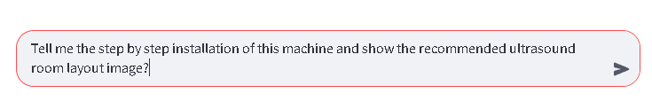
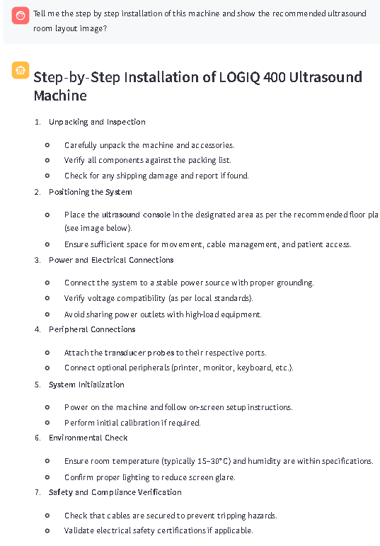
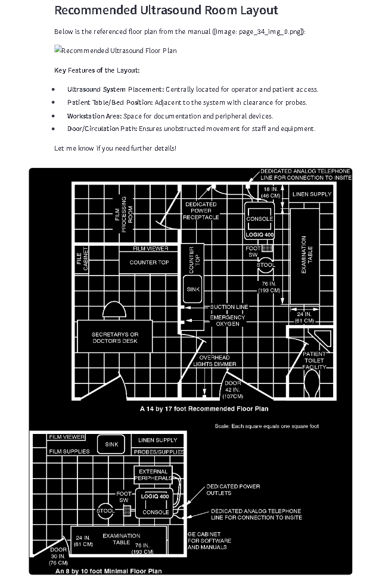
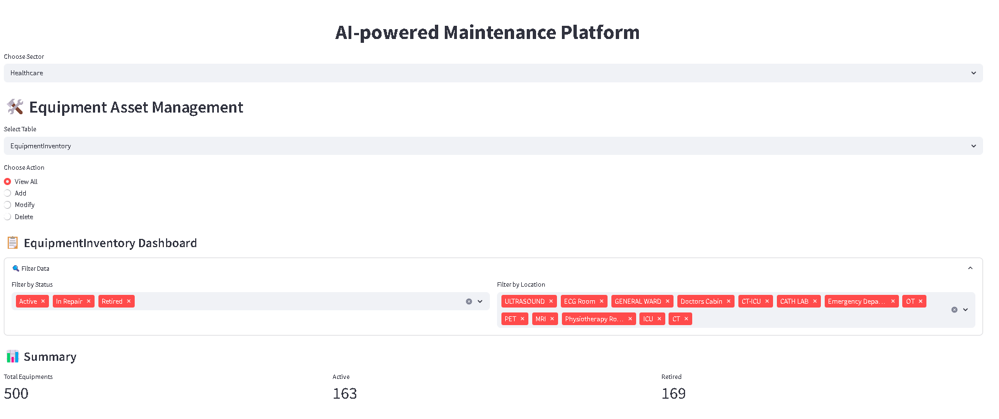
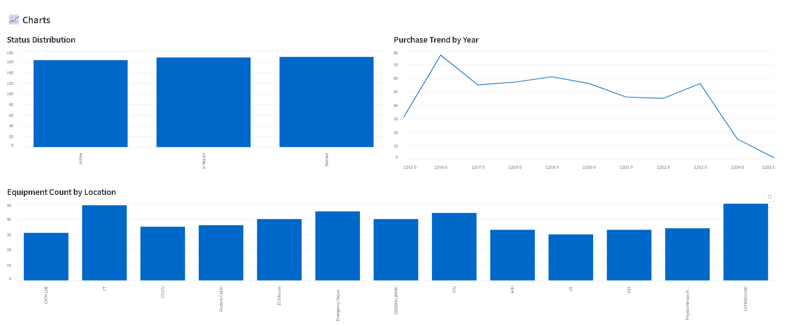
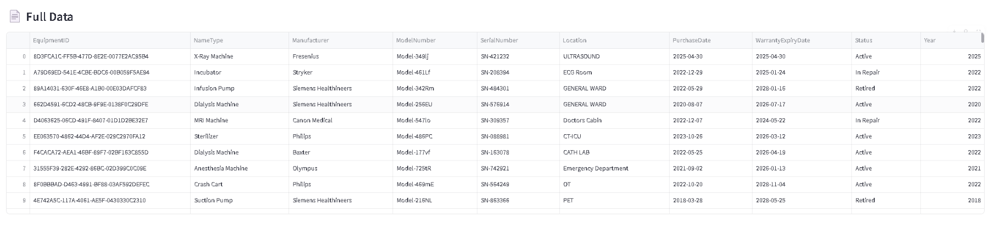
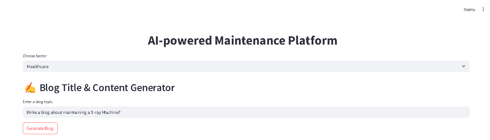
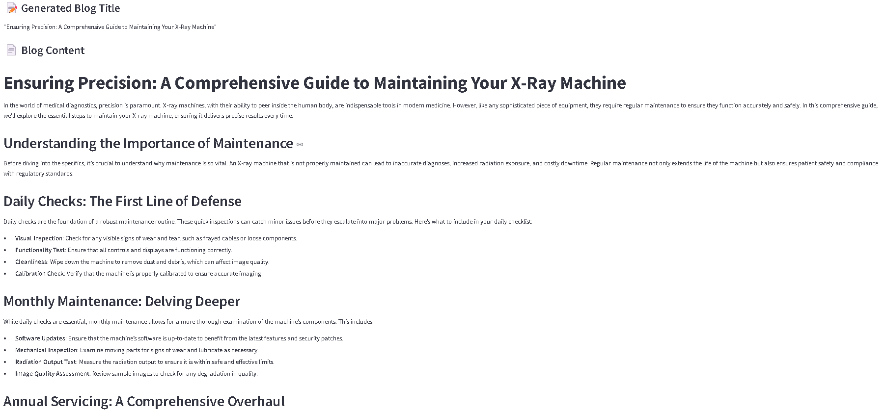

# 🧠 AI Agents Based Predictive Maintenance – Industry Equipment

### 🔍 Background & Overview

In industrial and healthcare settings, managing a large fleet of equipment—ranging from ventilators to CT scanners—requires precise tracking of maintenance schedules, spare parts, compliance records, and troubleshooting guides. Traditional CMMS (Computerized Maintenance Management Systems) often lack intelligent query support, real-time insights, or multimodal data understanding (e.g., manuals with images).

This project is an AI-powered Asset Management and Troubleshooting Assistant that integrates:

- 📚 **RAG-based multimodal manual understanding**
- 📊 **Interactive dashboards via Azure SQL**
- 🔍 **LLM-based routing for query analysis**
- 🤖 **LangGraph agents for intelligent task flows**
- ✍️ **Blog generator agent for marketing/report creation**

Together, these modules form a powerful assistant that combines the robustness of asset databases with the flexibility and reasoning power of large language models.

---

### 🎯 Target Audience

This AI-powered Equipment Maintenance Assistant is ideal for:

- 🏥 **Clinical/Biomedical Engineers** – managing hospital assets, preventive maintenance, and compliance.
- 🏭 **Industrial Maintenance Teams** – diagnosing issues and tracking repair logs across manufacturing plants.
- 🧠 **AI Developers/Researchers** – exploring agentic workflows (LangGraph), RAG, and Azure-based integration.
- 🧰 **Facility Managers & CMMS Users** – looking for an intelligent interface over conventional maintenance systems.
- 🛡️ **Healthcare IT & Compliance Officers** – ensuring traceable, compliant handling of equipment and records.

---

### 🚨 Problem Statement

- Maintenance staff often struggle to find **step-by-step troubleshooting guides** hidden deep within PDF manuals.
- Teams lack a **centralized intelligent interface** to view asset health, compliance, and service history.
- Reporting is either manual or siloed across spreadsheets, limiting decision-making speed.
- Traditional tools do not offer **natural language interaction**, **image retrieval**, or **AI-driven routing** based on user intent.

---

### ✅ Solution

This project solves these issues with an end-to-end AI solution:

- 📄 **Manual Assistant with RAG**: Upload a PDF manual and instantly ask questions. The system retrieves text and related images from the manual to guide troubleshooting.
- 🛠️ **Azure-based Asset Management**: Store, update, and view equipment status, parts, compliance records—complete with filtering and analytics.
- 🧠 **LLM Router**: Determines whether to answer from a manual, generate a report, or summarize dashboard data—automatically.
- 📝 **Report & Blog Generator**: Generate formatted summaries, maintenance reports, or blog content from equipment or user prompts.

This transforms a static, fragmented maintenance ecosystem into an intelligent, visual, and interactive support system.


## 🚀 Features

### 1. 📄 Manual Assistant (RAG)
- Upload or search equipment manuals
- Extracts both images and text from PDFs
- Stores content in **Azure CosmoDB** and **Azure Blob Storage**
- Answers troubleshooting questions with visual support

## 🧠 RAG Example Output

Here’s an example where the assistant responds with both text and visuals from the manual:


<p align="center">
  
  
</p>

Visuals plays a major role in this Industrial maintenance of the equipment by simplifying complex procedures, improving accuracy, and reducing downtime. Annotated diagrams, step-by-step visuals, and layout schematics help technicians:
    - Quickly identify components and understand their configuration.
    - Follow procedures with precision, reducing the risk of human error.
    - Troubleshoot effectively using side-by-side visual and textual cues.

These visual aids not only improve operational efficiency but also support regulatory compliance and preventive maintenance strategies, especially in high-stakes domains like healthcare, aerospace, or oil & gas.

### 2. 🛠️ Asset Manager (Azure SQL)
- Add, view, modify, and delete assets
- Interact with dashboards:
  - Equipment Status Distribution
  - Compliance Summary
  - Spare Part Availability





With seamless integration into the AI agent workflow, it empowers predictive insights and proactive maintenance planning based on real-time asset data.

### 3. 📊 Dashboard Summary & Report Generator
- **LLM routing** decides:
  - RAG for manual-based queries
  - Dashboard summary from SQL
  - Report generation for individual equipment

### 4. ✍️ Blog Creator Agent
Leverage the power of **LangGraph + GPT-4o** to generate high-quality blog content with minimal input. Ideal for marketing, documentation, or technical storytelling, this tool allows you to:

- 🧠 Generate catchy titles from a simple user prompt

- 📝 Write full-length blog posts based on AI-curated titles

- 🖥️ Streamlit-powered UI for easy topic entry and content review

- ⚙️ Seamlessly plug into your internal CMS or documentation pipelines




This feature turns your AI assistant into a creative content generator — automating writing for product updates, equipment overviews, or technical guides.


---

## 🧩 Tech Stack

| Layer       | Tools/Tech Used                                   |
|-------------|---------------------------------------------------|
| Backend     | Python, LangGraph, LangChain, OpenAI GPT-4o, Deepseek-chat      |
| Frontend    | Streamlit                                         |
| Storage     | Azure CosmoDB, Azure Blob Storage, Azure SQL      |
| DevOps      | Git, GitHub, dotenv                               |

---

## 📁 Project Structure

```bash
├── Agentic_RAG/                 # RAG graph logic
├── DataBase/                    # Azure SQL schema logic
├── Equipment_data/              # Data files (CSV)
├── RAG_modules/                 # PDF parsing and vector storage
├── manuals/                     # equipment manual storage
├── app.py                       # Streamlit main app
├── blog_generation.py           # LangGraph blog agent
├── asset_generation.py          # Asset SQL logic
├── csv_upload.py                # CSV uploader logic
├── manuals.py                   # Manual assistant logic
├── README.md
```

# 🧪 Running the Project
## 1. Clone the repo

```bash
git clone https://github.com/niranjankumarnk/MSFT_AI_AGENT_HACKATHON.git
cd MSFT_AI_AGENT_HACKATHON
```

## 2. Setup Environment

```bash
conda create -n msfthackvenv python=3.12 -y
conda activate msfthackvenv
pip install -r requirements.txt

```

## 3. Add .env file

Create a .env file and configure:

```bash
OPENAI_API_KEY=...
DEEPSEEK_API_KEY=...
MONGODB_URI=...
AZURE_STORAGE_CONNECTION_STRING=...
SQL_SERVER=...
SQL_DATABASE=...
SQL_USERNAME=...
PASSWORD=...
DRIVER={ODBC Driver 18 for SQL Server}
```

## 4. Run the app

```bash
streamlit run app.py
```

# 📝 Example Use Cases

- 🔧 “How do I reset the GE Dash 5000?” → Uses RAG with visuals.

- 📈 “Summarize all compliance records” → Uses dashboard summary.

- 📑 “Generate report for Dialysis Machine” → Uses SQL report tool.

- 📰 “Write a blog about industrial maintenance in hospitals” → Blog agent!


# ✅ Future Work & Enhancements

- [ ] 🔍 Add **Multi-modal Search** across images and text
- [ ] 📄 Enable **PDF Export** of equipment reports
- [ ] 🧠 Fine-tune LLMs for **domain-specific knowledge**
- [ ] 📡 Ingest **real-time IoT/sensor data** for predictive maintenance
- [ ] 📁 Support **bulk/manual uploads** with background processing
- [ ] 🔐 Add **Role-Based Access Control (RBAC)** for user management
- [ ] 📊 Visualize **maintenance & fault trends** over time
- [ ] ⏰ Trigger **automated alerts/reminders** for due maintenance
- [ ] 🗂️ Add **version tracking** and metadata diff for manuals


### 📌 Conclusion

This project combines the power of LangGraph agents, Retrieval-Augmented Generation (RAG), and Azure services to revolutionize how industrial or clinical maintenance teams interact with equipment data and manuals.

With capabilities like:

- Intelligent agent decision-making
- Interactive dashboards
- Image-enhanced troubleshooting
- Equipment-wise report generation

…this solution not only acts as a **smart CMMS** alternative, but also pushes the boundaries of human-AI collaboration in mission-critical environments.

# 📃 License
Licensed under the Apache 2.0 License.

# ✨ Authors
Niranjan Kumar Kishore Kumar – AI + Healthcare Enthusiast


